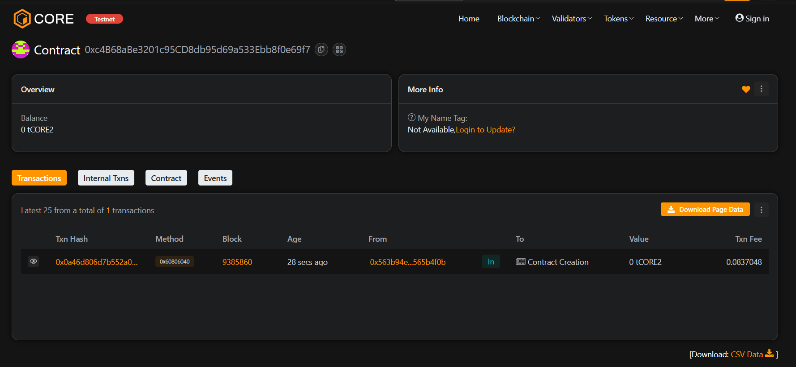

# 💎 CryptonForge

### Project Description
**CryptonForge** is a decentralized digital asset forging platform that enables users to mint unique assets directly on the blockchain.  
Each minted (forged) asset is stored immutably, with details like creator, value, and timestamp, ensuring authenticity and ownership.

---

### 🌍 Project Vision
To empower users to create, own, and trade their digital assets securely without intermediaries.  
CryptonForge envisions a transparent system for creators to establish on-chain proof of originality and ownership.

---

### ⚙️ Key Features
- **Forge Assets:** Instantly mint custom digital assets with metadata.  
- **Ownership Transfer:** Seamlessly transfer smart contract control.  
- **Transparent Tracking:** Every minted asset is public and verifiable.  
- **On-chain Records:** Immutable and timestamped entries for all creations.

---

### 🚀 Future Scope
- Integration with ERC721 (NFT) for asset uniqueness.  
- Web3 frontend dashboard using React.js.  
- Integration with IPFS for decentralized asset metadata.  
- Multi-chain support (Polygon, BSC, Avalanche).  
- Staking mechanism for premium creators.

---

### 🧰 Tech Stack
- **Solidity** – Smart contract logic  
- **Hardhat** – Development and testing environment  
- **JavaScript** – Deployment and test scripts  
- **Ethereum / Sepolia Testnet**

---

Contract detail : 0xc4B68aBe3201c95CD8db95d69a533Ebb8f0e69f7


### 🪄 Commands

```bash
# Install dependencies
npm install

# Compile contracts
npx hardhat compile

# Run tests
npx hardhat test

# Deploy to Sepolia testnet
npx hardhat run scripts/deploy.js --network sepolia
